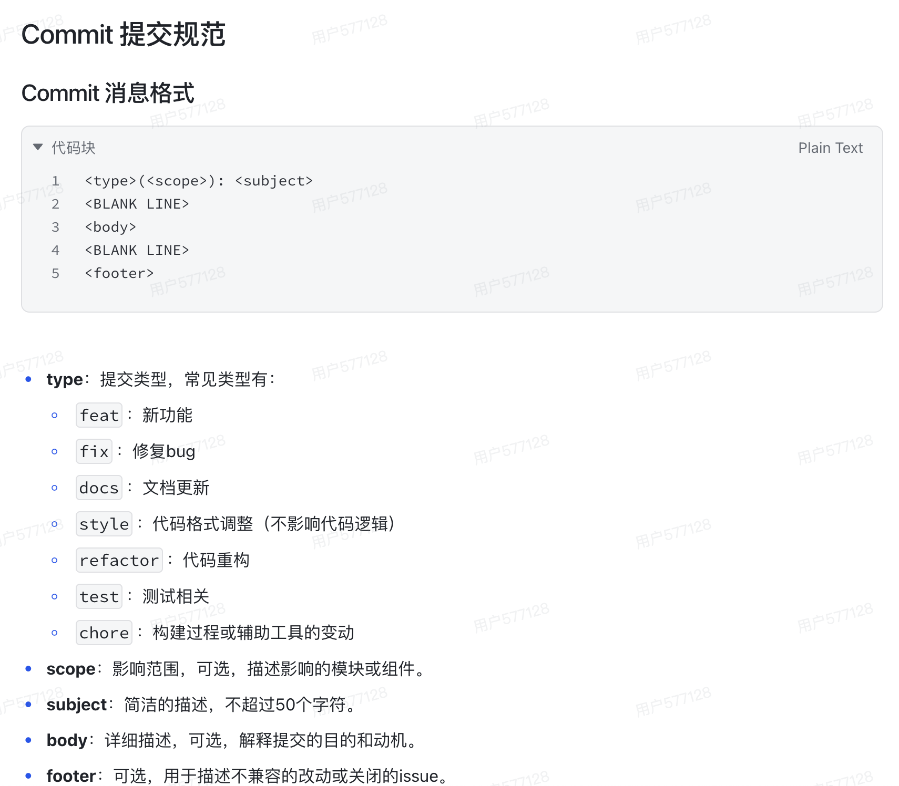

# C++ AI 模拟面试

这是一个用于学习 C++ 工程化、LLM、实时语音、音频和 Qt 的模拟面试项目。当前已经具备：

- mock/HTTP LLM 出题与评分。
- PDF 简历文本解析。
- mock/火山 realtime 对话编排。
- PortAudio 麦克风采集和 TTS 播放。
- CLI、realtime demo 和 Qt 桌面界面。
- 结构化 JSON 面试报告。

## 构建与测试

项目使用 C++17、CMake 和 vcpkg。首次引入 Qt 时，`qtbase` 安装会比普通增量构建耗时更长。

```bash
cmake -S . -B build -DCMAKE_BUILD_TYPE=Debug -DCMAKE_EXPORT_COMPILE_COMMANDS=ON
cmake --build build -j
ctest --test-dir build --output-on-failure
```

## 运行 Qt 界面

macOS 会生成带麦克风用途声明的 `.app`：

```bash
./build/AI_mock_interview_qt.app/Contents/MacOS/AI_mock_interview_qt config.example.json
```

也可以双击 `build/AI_mock_interview_qt.app`。默认 `config.example.json` 使用 mock provider，
不会联网或访问麦克风。真实语音面试请在界面中选择被 Git 忽略的 `config.local.json`，并保持：

```json
{
  "realtime": {
    "provider": "volc",
    "dialog": {
      "input_mod": "keep_alive"
    }
  }
}
```

真实 API key、App ID 和 Access Key 只能放在 `config.local.json` 或环境变量中，不能提交、
截图或写入日志。第一次运行真实语音模式时，macOS 会请求麦克风权限。

## Qt 数据流

```text
MainWindow（主线程）
  -> QThread / InterviewWorker
  -> 配置、LLM、PDF、Realtime、PortAudio
  -> DialogOrchestrator
  -> IDialogObserver 回调
  -> queued Qt signals
  -> MainWindow 状态、对话和报告路径
```

窗口关闭或点击“停止面试”时只设置原子取消令牌。WebSocket、PortAudio 和 HTTP future
仍由 worker 在安全点统一清理，避免 UI 线程并发操作外部资源。

## 历史提交笔记

Commit 提交规范


