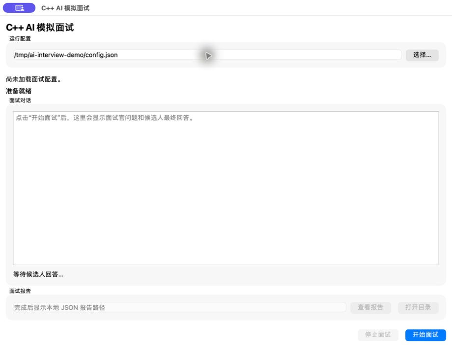
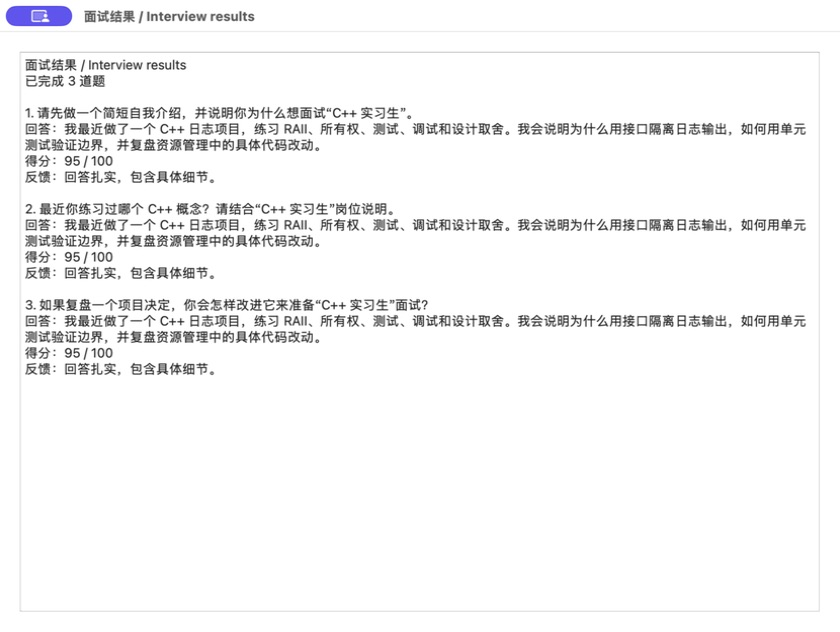

# C++ AI 模拟面试

一个用于学习 C++17 工程化、LLM、实时语音、音频和 Qt 的面试练习项目。
支持出题、记录回答、评分、追问和本地报告。

[English](README.md) · [完整首次构建步骤](docs/building.md) ·
[30 秒图文演示](docs/assets/mock-walkthrough.mp4)

## 软件效果

以下是实际运行 Qt 程序取得的截图，使用虚构候选人及确定性的 Mock 规则。





默认 Qt Mock 会自动使用预设回答，不联网、不访问麦克风，也不需要 API Key。
截图里的 95 分是 Mock 规则计算结果，不代表真实 AI 评分准确度。
想自己输入回答，可以先使用 CLI。

## 首次运行

首次安装请先按 [构建指南](docs/building.md) 安装系统依赖、vcpkg，设置 `VCPKG_ROOT`。
Mock 只取消运行时的服务要求；当前编译仍需要 Qt、Boost、OpenSSL、PortAudio 和 PoDoFo。

```sh
cmake -S . -B build -DCMAKE_BUILD_TYPE=Debug \
  -DCMAKE_TOOLCHAIN_FILE="$VCPKG_ROOT/scripts/buildsystems/vcpkg.cmake"
cmake --build build --parallel 2
ctest --test-dir build --output-on-failure
```

macOS 启动 Qt：

```sh
./build/AI_mock_interview_qt.app/Contents/MacOS/AI_mock_interview_qt config.example.json
```

Ubuntu 图形桌面启动：

```sh
./build/AI_mock_interview_qt config.example.json
```

点击“开始面试”，完成后点击“查看报告”直接阅读回答、评分和反馈。
“打开目录”可以定位 JSON 文件。报告保存在启动工作目录下的 `reports/`。

命令行自己输入回答：

```sh
./build/AI_mock_interview config.example.json
```

无显示器也能自动完成演示：

```sh
./build/AI_mock_interview_realtime_demo config.example.json
```

## 已有能力与边界

- mock/HTTP LLM 出题与评分，支持追问。
- 可选 PDF 简历文本解析。
- mock/火山 realtime 对话编排。
- PortAudio 麦克风采集和 TTS 播放适配器。
- CLI、realtime demo 和 Qt 桌面界面。
- 结构化 JSON 报告及 Qt 只读报告预览。
- 离线单元测试、Qt 测试及 CI 入口闭环检查。

Qt Mock 当前没有文字输入框，预设回答会自动执行；真实语音需要服务凭证、
可用额度和音频设备。真实服务状态与 Mock/CI 是否通过是两回事。

## Qt 数据流

```text
MainWindow（主线程）
  -> QThread / InterviewWorker
  -> 配置、LLM、PDF、Realtime、PortAudio
  -> DialogOrchestrator
  -> IDialogObserver 回调
  -> queued Qt signals
  -> MainWindow 对话和报告路径
  -> 查看本地报告（纯文本，不重新调用服务）
```

关闭窗口或点击“停止面试”时只设置原子取消令牌，worker 在安全点清理外部资源。
桌面日志写入系统应用数据目录；日志文件不可写时保留控制台输出，避免空指针崩溃。

真实服务配置见 [构建指南的 Optional real services](docs/building.md#optional-real-services)。
密钥只能保存在 `config.local.json` 或环境变量，不放入日志、截图或 Git。

更多说明：[代码讲解](docs/code_explanations/README.md)、
[开发规范](docs/development.md)、[演示制作说明](docs/demo.md)、
[开发记录](development_records/)。
