# Commit提交规范

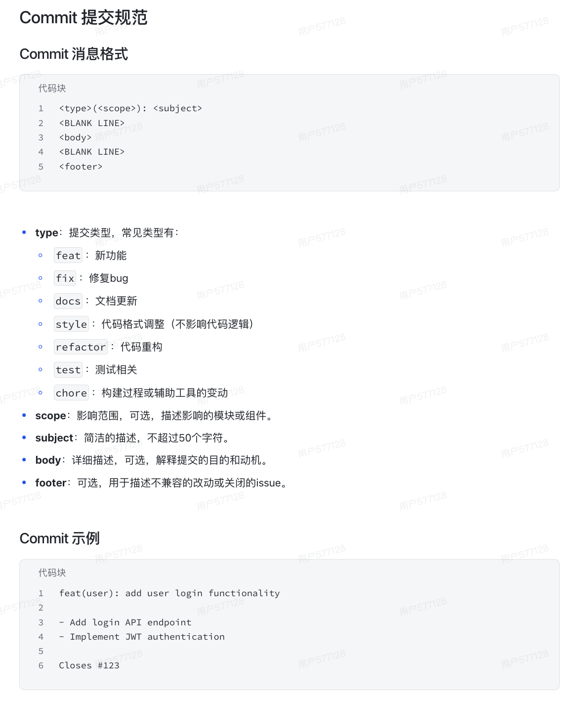 

# 项目架构 

## 1.项目架构

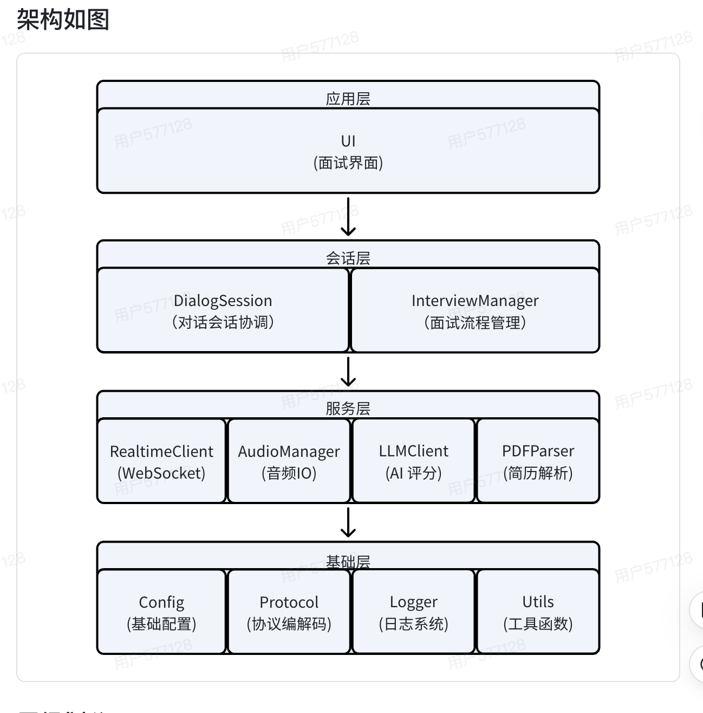 

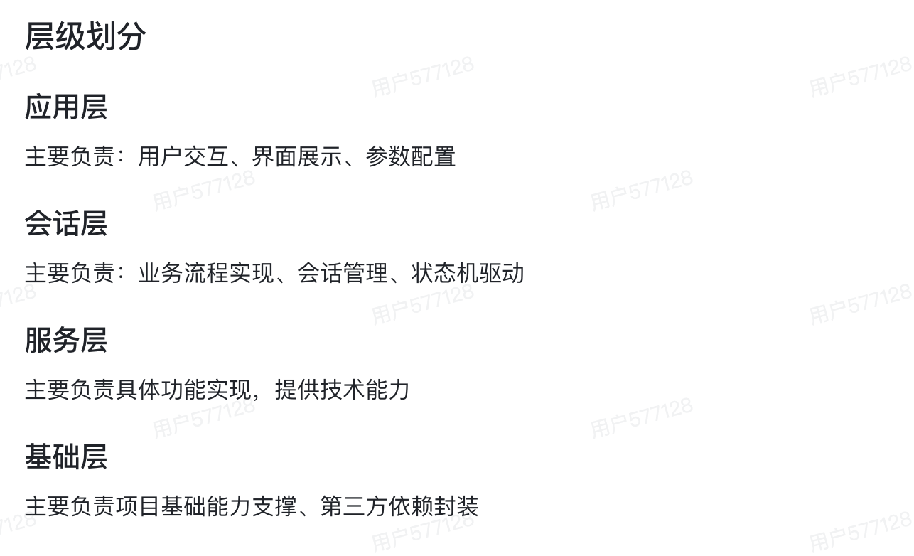 

## 2.状态机流程图

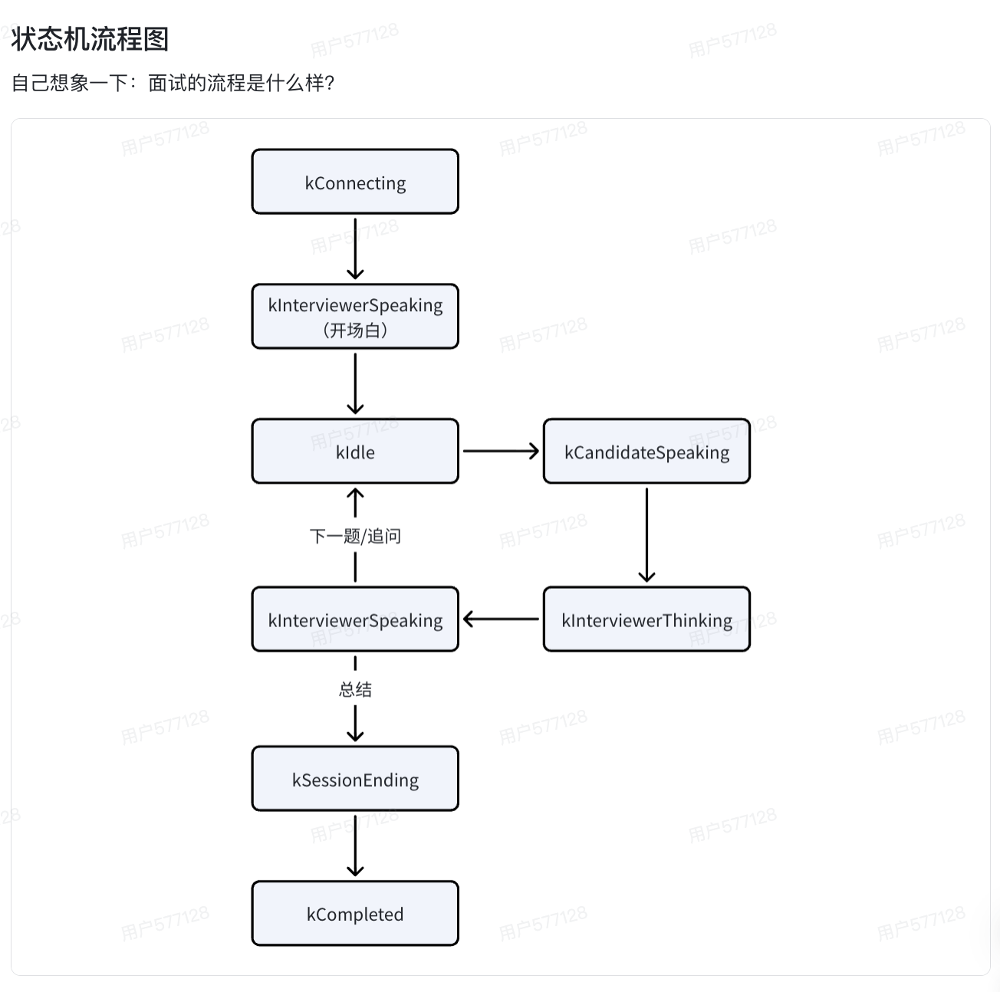 

## 3.面试流程时序图

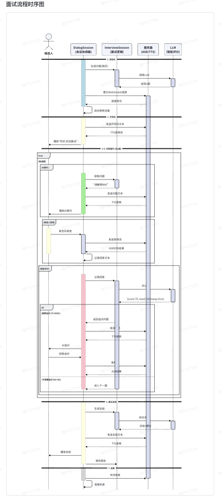 

# 环境搭建

## 前置准备工作

### 1.开发环境

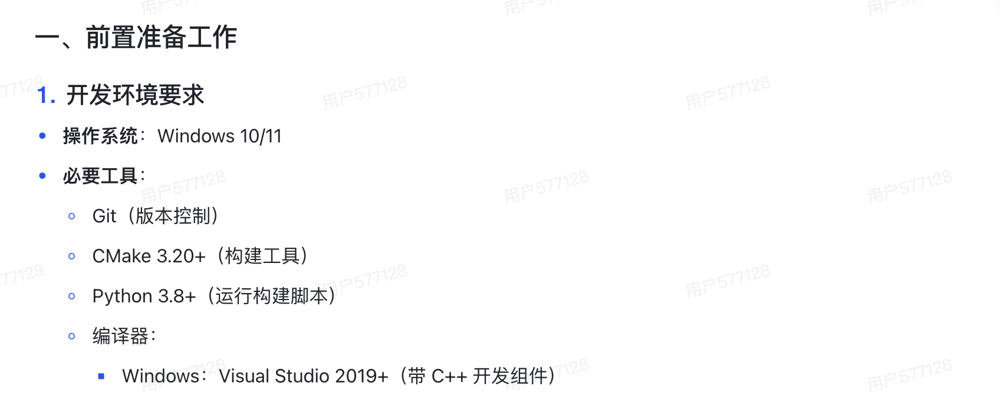 

### 2.账号与API密钥准备

#### 	a.飞书豆包语音平台

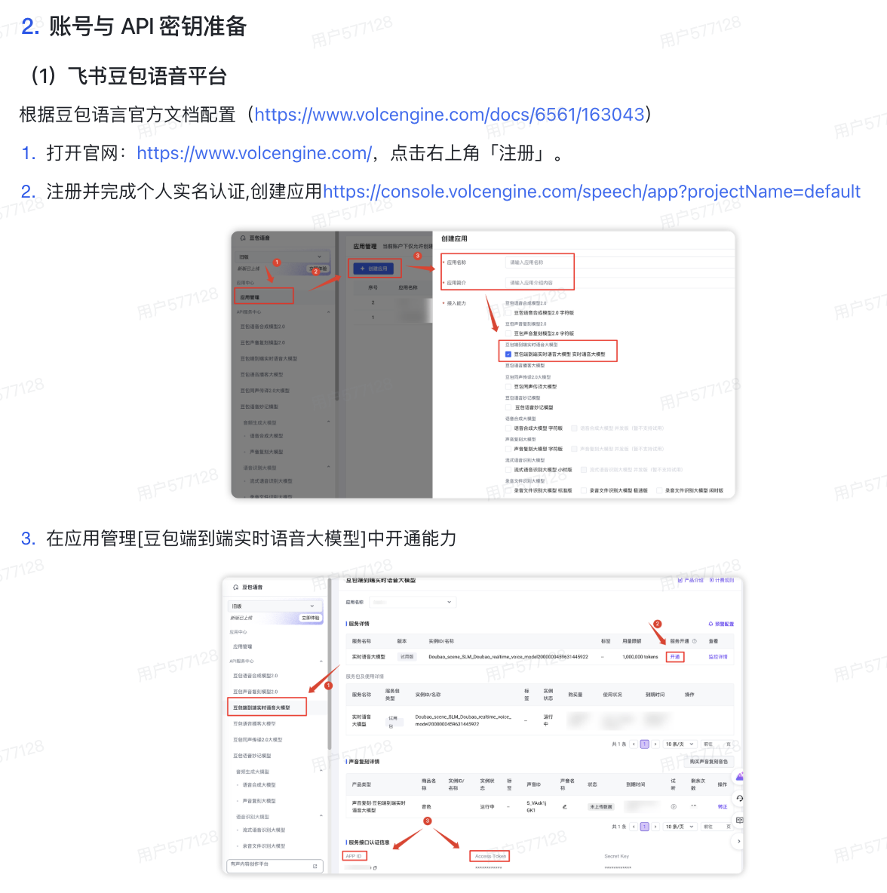 

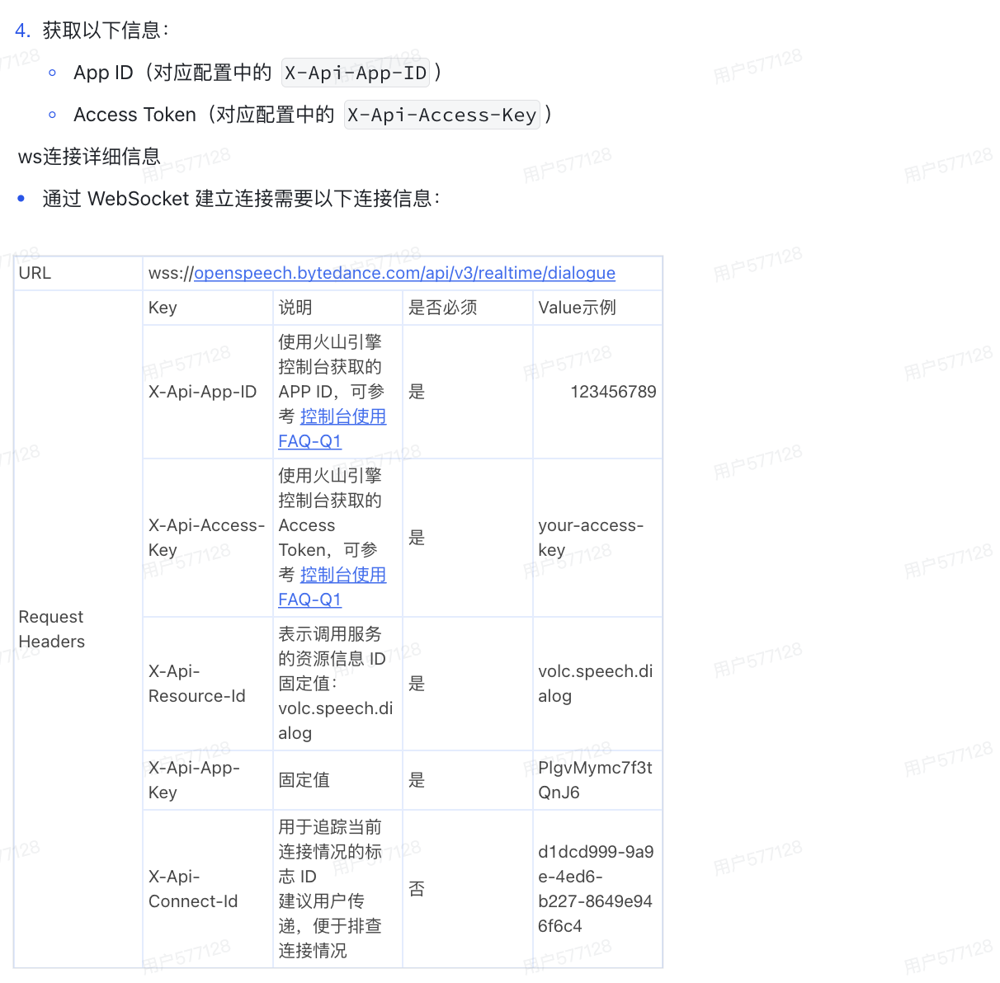

#### 	b.小马算力平台

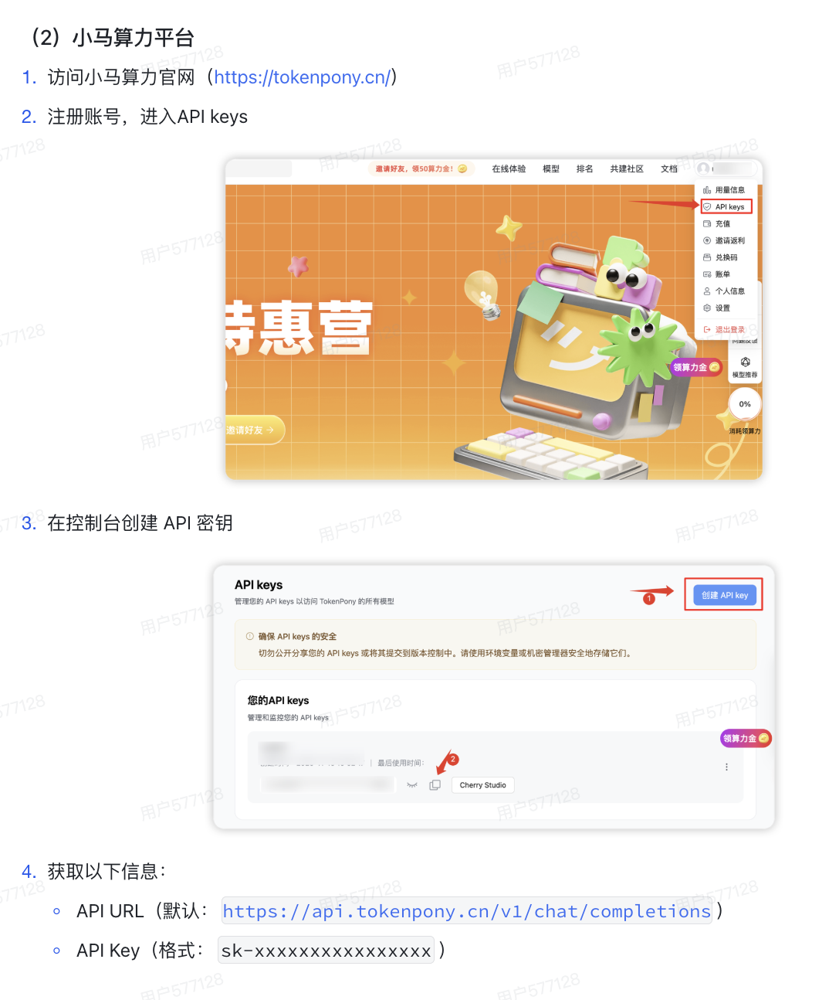

## 环境搭建步骤

###   	1.安装vcpkg

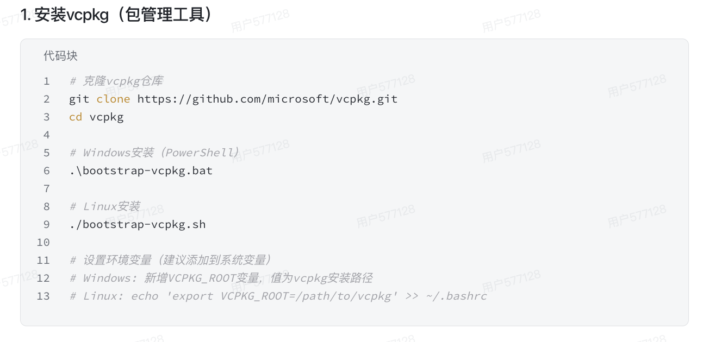

### 	2.安装项目依赖

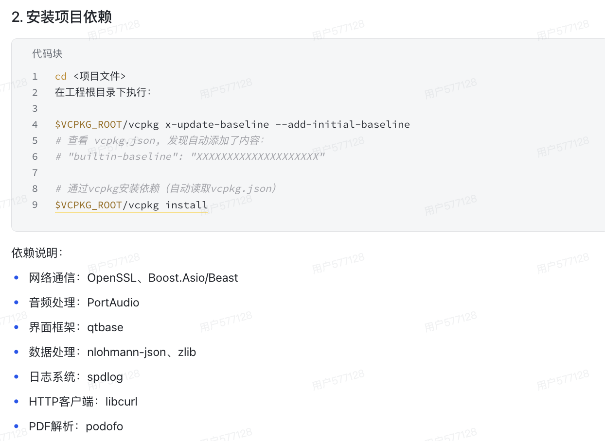 

## 配置文件修改

### 1.配置文件位置

 

### 2.关键配置项修改

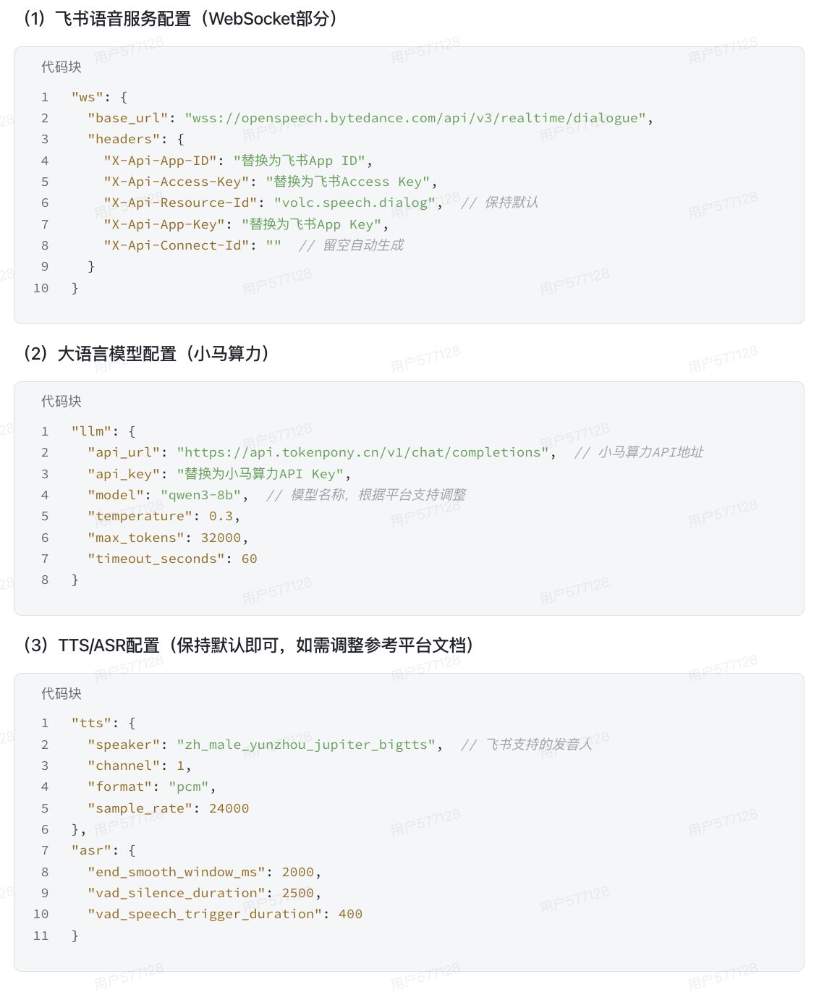 

## 项目的编译和运行

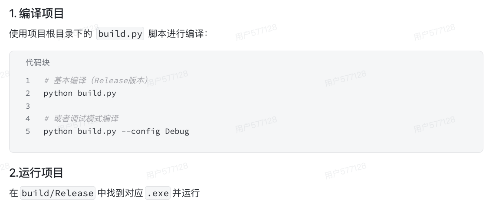 

